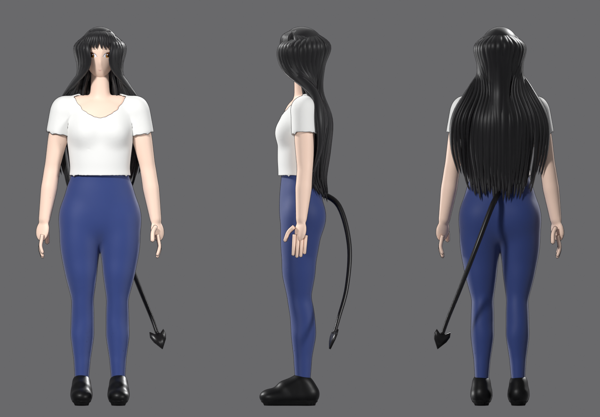

# Sarah in Blender

`sarah_model.py` builds Sarah's 3D model from scratch: long black hair with
bangs, amber anime eyes, white T-shirt, navy leggings, black sneakers and the
devil tail with a spade tip. It's based on the front / side / back turnaround
pictures. `export_vrm.py` turns that model into a `.vrm` the app can load.



## Files

| File | What it is |
| --- | --- |
| `sarah_model.py` | Builds everything: body, head, painted face, hair, clothes, tail, rig, skin weights |
| `export_vrm.py` | Puts her in a T-pose, maps the humanoid bones, makes the tail springy, writes `sarah.vrm` |
| `out/sarah.blend` | The built scene. Open it to keep sculpting or tweaking |
| `out/sarah.vrm` | Ready for the app (VRM 1.0) |
| `out/sarah_face.png` | The painted face texture (eyes, brows, mouth, blush) |
| `out/preview_*.png` | Cycles renders: front, side, back, face close-up |

`out/sarah.glb` (plain glTF) is also written each run, but it isn't committed
because `sarah.vrm` is the same model.

## Rebuild

Blender 4.2 or newer:

```bat
blender --background --python blender\sarah_model.py
blender --background --python blender\export_vrm.py
```

Or build her inside the Blender you have open: go to the **Scripting** tab,
click **Open**, pick `blender\sarah_model.py` and press **Run Script** (▶).
This clears the current scene, builds her (about 20 seconds, during which
Blender may look frozen), switches the viewport to Material Preview and saves a
copy to `blender\out\sarah.blend`. Your open file stays the one you're
working in. Preview renders are skipped in this mode.

From the command line, `--no-render` skips the renders, `--render` forces them
and `--out <folder>` writes somewhere else.

`export_vrm.py` needs the **VRM format** add-on
(Edit > Preferences > Get Extensions, search "VRM"). Or pass its source folder:
`-- --addon path\to\VRM-Addon-for-Blender\src`.

To change her look, edit the settings at the top of `sarah_model.py`: head
size, how far the arms hang out, sleeve length, shirt hem, waistband and all
the colours. Body shape is in `build_body()` (each line is one cross-section:
height, half width, half depth). The face is painted in `paint_face()`.

## Using her in the app

Back up `frontend\renderer\assets\vrm\sarah.vrm`, then copy
`blender\out\sarah.vrm` over it. That file is gitignored, so your personal
model is never overwritten by a pull.

I loaded this VRM with three.js + three-vrm (the same loader the app uses) in
headless Chromium and checked it: all 22 humanoid bones map, the arms and head
pose correctly, the sleeves follow the arms and the tail swings on spring
bones.

## What she can't do yet

- **No facial expressions or lip sync.** The face is a painted texture with
  no blend shapes, so blinking, smiling and mouth movement won't show.
  Sculpting shape keys for blink / aa / ih / ou / ee / oh / happy and binding
  them in the VRM panel would add this.
- **Hair is stiff.** It's skinned to the head, neck and chest. Hair bones with
  spring bones would let it sway.
- **No finger bones.** Each hand moves as one piece.
- **Simple sneakers**, with no laces or stitching.
- Outlines are an inverted-hull trick that only shows in Blender/Cycles
  renders. VRM viewers skip it. Converting the materials to MToon in the VRM
  panel gives you the app's own toon outline.
